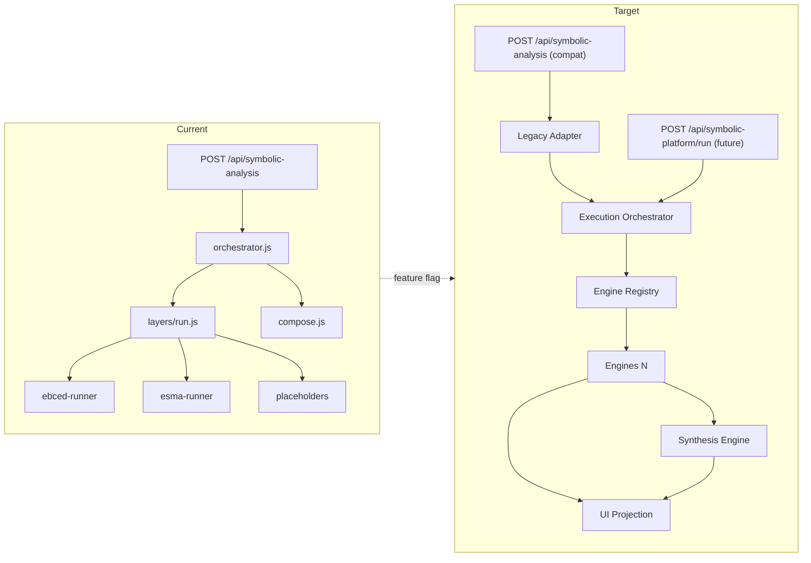

# ATLAS SYMBOLIC PLATFORM — MASTER ARCHITECTURE RFC

> **ARCHIVED (2026-08-04)**  
> Platform-wide architecture authority is now:  
> [`docs/architecture/ATLAS_MASTER_ARCHITECTURE_SPECIFICATION_v1.md`](./architecture/ATLAS_MASTER_ARCHITECTURE_SPECIFICATION_v1.md)  
> Disposition: **Archive** (symbolic lineage overview).  
> **Child RFCs (RFC-001…010) remain binding** for ebced/esma contracts under the Master Spec.  
> This file does **not** authorize production code changes.

**Status:** Archived (historical) — previously normative symbolic platform architecture (design only)  
**Document id:** `atlas-symbolic-platform-master-v1`  
**Last updated:** 2026-07-31  
**Implementation status:** Spec only — **no production code change authorized by this document**  
**Supersedes (scope):** Single-envelope `server/symbolic-analysis` as the long-term platform shape  
**Preserves:** ADR-001…005, methodology ids, Operational Appendix privacy/audit rules, existing `/api/symbolic-analysis` wire until migration RFCs complete  

**Child RFCs:**

| RFC | Title |
|-----|-------|
| [RFC-001](./rfc/RFC-001-ENGINE-CONTRACT.md) | Engine Contract |
| [RFC-002](./rfc/RFC-002-METHODOLOGY-REGISTRY.md) | Methodology Registry |
| [RFC-003](./rfc/RFC-003-RESULT-CONTRACT.md) | Result Contract |
| [RFC-004](./rfc/RFC-004-CONFIDENCE-EVIDENCE.md) | Confidence & Evidence |
| [RFC-005](./rfc/RFC-005-SYMBOLIC-SYNTHESIS.md) | Symbolic Synthesis Engine |
| [RFC-006](./rfc/RFC-006-ENGINE-LIFECYCLE.md) | Engine Lifecycle |
| [RFC-007](./rfc/RFC-007-LEGACY-MIGRATION.md) | Legacy Migration |
| [RFC-008](./rfc/RFC-008-SAFETY-AUDIT-TRACE.md) | Safety, Audit & Trace |

---

## 1. Purpose

Atlas’i tek bir “Symbolic Analysis” monolit akışından çıkarıp, **bağımsız, sürümlenebilir uzman analiz motorlarından** oluşan bir platforma dönüştüren ana standardı tanımlar.

Tüm gelecekteki motorlar aynı:

- veri sözleşmelerini,
- metodoloji açıklama standardını,
- güven modelini,
- izlenebilirlik yapısını,
- güvenlik sınırlarını

kullanmak zorundadır.

---

## 2. Scope

- Platform katmanları ve sorumluluk sınırları
- Engine zorunlu tanım alanları
- Ortak result / assessment / confidence / evidence / disclosure sözleşmeleri
- Engine + Methodology + Capability registries
- Execution Orchestrator ve failure isolation
- Symbolic Synthesis Engine (üst motor)
- UI projection standardı
- Roadmap, migration, test stratejisi (özet; detay child RFC’lerde)
- Mevcut `server/symbolic-analysis` → hedef platform geçiş haritası

---

## 3. Out of Scope

- Production kodu, refaktör, endpoint değişikliği, UI değişikliği
- Metodoloji formül detayı (CLASSICAL_ABJAD_RULES_SPEC, ESMA matching RFCs’e bırakılır)
- Fatwa / tıbbi / hukuki / finansal tavsiye üretimi
- Payment-tier’a göre farklı hesap sonucu (Operational Appendix: methodology correctness MUST NOT vary by tier)

---

## 4. Definitions

| Terim | Tanım |
|--------|--------|
| **Engine** | Bağımsız, register edilebilir, sürümlenebilir uzman analiz birimi (`engineId` + `version`) |
| **Methodology** | Hesap/eşleme kurallarının adlandırılmış, sürümlü tanımı (`methodologyId` + `methodologyVersion`) |
| **Variant** | Aynı methodology ailesi içinde seçilebilir alt kural seti |
| **Capability** | Bir engine’in verilen girdi + feature flag + bağımlılıklar altında çalışabilirlik durumu |
| **EngineResult** | Ortak sonuç envelope’u (RFC-003) |
| **Legacy Symbolic Analysis** | Mevcut `server/symbolic-analysis` monolit envelope (`atlas-symbolic-analysis-v1`) |
| **Layer (legacy)** | Eski iç kimlik (`ebced`, `esma`, …) — platformda **Engine**’e map edilir; ürün dili değildir |
| **Synthesis** | Kaynak engine sonuçlarını değiştirmeyen üst motor (RFC-005) |
| **UI Projection** | Ham `EngineResult` → kullanıcıya gösterilebilir kart/section dönüşümü |
| **Legacy Adapter** | Eski response ↔ yeni contract dönüştürücü (RFC-007) |

---

## 5. Normative Rules

1. Her yeni uzman analiz **MUST** bir `engineId` ile Engine Registry’ye kaydolur.
2. Her çalıştırma **MUST** bir `EngineResult` üretir (success, partial, failed, veya skipped).
3. Yeni API yanıtlarında scalar `confidence` **MUST NOT** (ADR-003). Multi-axis confidence + assessment **MUST**.
4. Safety Layer hesap değerlerini **MUST NOT** değiştirir; yalnızca sunum/yorum sınırlarını yönetir.
5. Synthesis kaynak `result` / `evidence` / `assessment` alanlarını **MUST NOT** override eder.
6. Eksik girdi **MUST NOT** uydurulur; ilgili engine `skipped` veya `failed` (validation) döner.
7. Bir engine’in yüklenememesi / timeout / exception’ı diğer bağımsız engine’leri **MUST NOT** durdurur.
8. Methodology id’ler (`atlas-letter-number-v2`, `abjad-kabir-classical-v1`, `esma-theme-intention-match-v1`, …) **MUST** korunur; sessiz rename yasak.
9. Üç sistem (Latin motif / Classical Abjad / Esma) UI/API’de tek doğruluk olarak **MUST NOT** birleştirilir (CURRENT_VS_TARGET §5.8).
10. Platform contracts değişmeden önce ADR-001…005 ve Pre-Faz Decision Gate **MUST** closed kalır.

---

## 6. Current Architecture (verified)

### 6.1 Module map

```
server/symbolic-analysis/
├── index.js                 # public exports
├── orchestrator.js          # consent → capability → sequential layers → soft synthesis → compose
├── capability.js            # LAYER_READINESS, LAYER_REQUIREMENTS, INPUT_CONTRACT
├── schema.js                # SYMBOLIC_LAYER_IDS, user sections, makeLayerOutcome
├── normalize.js             # NormalizedSymbolicLayer (+ legacy scalar confidence)
├── compose.js               # userResult sections + methodDisclosure
├── safety.js                # prose certainty filter
├── methodology-ids.js       # Latin v1/v2 ids + ATLAS_SYMBOLIC_METADATA_V2 flag
├── methodology-metadata.js  # assessment + snapshots (v2 path)
├── layers/
│   ├── run.js               # if/else dispatcher (NOT a registry)
│   ├── ebced-runner.js      # Latin letter-sum-reduce (live)
│   ├── esma-runner.js       # theme-intention catalog match (live)
│   └── placeholders.js      # cifir, simya, mizac, fizyonomi
└── data/
    ├── ebced-table.js
    └── esma-catalog.js

Frontend:
  src/types/symbolic-analysis.ts
  src/services/symbolic-analysis.ts → POST /api/symbolic-analysis
  src/pages/SymbolicAnalysisPage.tsx

Adjacent (not the same envelope):
  server/cross-layer-synthesis/   # chat/daily meta-synthesis
  server/daily-analysis/          # daily temporal layers
```

### 6.2 Runtime shape (today)

| Concern | Current behavior |
|---------|------------------|
| Identity | Fixed `SYMBOLIC_LAYER_IDS` array |
| Dispatch | Hardcoded `if (ebced) / else if (esma)` |
| Isolation | try/catch per layer; orchestrator continues |
| Soft synthesis | `synthesizePatterns()` inside orchestrator |
| User output | Meaning sections (`summary`, `pattern`, …) — technical ids hidden |
| Methodology | Additive under `ATLAS_SYMBOLIC_METADATA_V2` |
| Assessment | ADR-003 shape on v2 metadata path only |
| Confidence | Legacy scalar still on `normalized.confidence` |
| Trace | Internal; omitted from client unless `include_trace` |
| Registry | **Absent** |
| Versioning per engine | **Absent** (single envelope version) |
| Feature flag per engine | Partial (metadata v2 only) |

### 6.3 Live vs placeholder

| Legacy layerId | Readiness | Runner | Target engine (planned) |
|----------------|-----------|--------|-------------------------|
| `ebced` | available | `ebced-runner.js` | `atlas-latin-number-motif` (+ later split classical) |
| `esma` | available | `esma-runner.js` | `esma-matching` |
| `cifir` | planned | placeholder | (future; not in v1 engine list) |
| `simya` | planned | placeholder | (future) |
| `mizac` | planned | placeholder | (future) |
| `fizyonomi` | unavailable | placeholder | `symbolic-image-analysis` |
| — | — | — | `classical-abjad` (new; not a legacy layer id) |
| — | — | — | `astrology` |
| — | — | — | `destiny-matrix` |
| — | — | — | `hijri-time` |
| — | — | — | `symbolic-document-analysis` |
| soft patterns | in orchestrator | — | `symbolic-synthesis` |

---

## 7. Target Architecture

### 7.1 Platform tree

```
Atlas Symbolic Platform
├── Astrology Engine
├── Classical Abjad Engine
├── Atlas Latin Number Motif Engine
├── Esma Matching Engine
├── Destiny Matrix Engine
├── Hijri Time Engine
├── Symbolic Image Analysis Engine
├── Symbolic Document Analysis Engine
└── Symbolic Synthesis Engine
```

Liste genişletilebilir: yeni motor = Registry kaydı + contract test paketi + UI projection; orchestrator kodu değiştirilmeden (plugin model).

### 7.2 Proposed module boundaries

```
server/symbolic-platform/                    # NEW (future implementation)
├── contracts/                               # shared TS/JS types & validators
│   ├── engine-result.ts
│   ├── assessment.ts
│   ├── confidence.ts
│   ├── evidence.ts
│   ├── disclosure.ts
│   └── warnings.ts
├── registries/
│   ├── methodology-registry.ts
│   ├── engine-registry.ts
│   └── capability-registry.ts
├── orchestrator/
│   ├── execution-orchestrator.ts
│   ├── input-validation.ts
│   └── dependency-resolver.ts
├── layers/
│   ├── safety/
│   ├── audit/
│   ├── trace/
│   ├── snapshot/
│   ├── version-compatibility/
│   ├── reporting/
│   └── ui-projection/
├── engines/
│   ├── classical-abjad/
│   ├── latin-number-motif/
│   ├── esma-matching/
│   ├── astrology/
│   ├── destiny-matrix/
│   ├── hijri-time/
│   ├── symbolic-image/
│   ├── symbolic-document/
│   └── symbolic-synthesis/
└── adapters/
    └── legacy-symbolic-analysis/            # RFC-007

# Temporary coexistence
server/symbolic-analysis/                    # LEGACY — kept until sunset
```

### 7.3 Current → Target transition diagram



---

## 8. Mandatory Engine Definition

Her engine kaydı **MUST** aşağıdaki alanları sağlar (detay: RFC-001):

| Field | Purpose |
|-------|---------|
| `engineId` | Stable machine id |
| `displayName` | UI label |
| `version` | Semver engine implementation |
| `status` | `active` \| `limited` \| `disabled` \| `deprecated` \| `planned` |
| `purpose` | One-sentence product purpose |
| `scope` | What it computes |
| `outOfScope` | Explicit non-goals |
| `methodology` | Human description |
| `methodologyId` | Default methodology binding |
| `supportedVariants` | Variant ids |
| `inputContract` | Required/optional fields + types |
| `outputContract` | Engine-specific result extension schema |
| `evidenceContract` | Allowed evidence kinds |
| `confidenceModel` | Which confidence axes apply |
| `assessmentContract` | ADR-003 + engine extensions |
| `methodDisclosure` | User-facing disclosure template |
| `safetyRules` | Engine-local + platform inheritance |
| `limitations` | Static limitation catalog |
| `warnings` | Conditional warning catalog |
| `traceRequirements` | Mandatory trace fields |
| `auditRequirements` | Mandatory audit events |
| `snapshotRequirements` | Input + reproducibility snapshot rules |
| `UIRepresentation` | Projection recipe id |
| `backwardCompatibilityPolicy` | How old results read |
| `deprecationPolicy` | Sunset rules |

### 8.1 Initial engine catalog (normative ids)

| engineId | displayName | Initial status | Default methodologyId |
|----------|-------------|----------------|------------------------|
| `astrology` | Astrology Engine | `planned` | TBD (not invented here) |
| `classical-abjad` | Classical Abjad Engine | `planned` | `abjad-kabir-classical-v1` |
| `latin-number-motif` | Atlas Latin Number Motif Engine | `active` (via legacy) | `atlas-letter-number-v2` |
| `esma-matching` | Esma Matching Engine | `active` (via legacy) | `esma-theme-intention-match-v1` |
| `destiny-matrix` | Destiny Matrix Engine | `planned` | TBD |
| `hijri-time` | Hijri Time Engine | `planned` | TBD |
| `symbolic-image-analysis` | Symbolic Image Analysis Engine | `planned` | TBD |
| `symbolic-document-analysis` | Symbolic Document Analysis Engine | `planned` | TBD |
| `symbolic-synthesis` | Symbolic Synthesis Engine | `planned` | `atlas-symbolic-synthesis-v1` |

---

## 9. Common Platform Layers

Her bileşen için: sorumluluk / giriş / çıkış / sahip olmadığı sorumluluklar / ilişkiler.

### 9.1 Methodology Registry

- **Sorumluluk:** Methodology tanımlarını versioned tutmak; engine binding’leri doğrulamak.
- **Giriş:** `methodologyId`, version query, variant id.
- **Çıkış:** MethodologyDescriptor (RFC-002).
- **Değil:** Hesap çalıştırmaz; UI render etmez.
- **İlişki:** Engine Registry metodoloji seçiminde sorgu yapar; Snapshot Layer id’leri kaydeder.

### 9.2 Engine Registry

- **Sorumluluk:** Engine plugin kaydı, version seçimi, feature flag, priority, timeout, fallback policy, disable/deprecate.
- **Giriş:** `register(engine)`, `resolve(engineId, version?)`.
- **Çıkış:** ExecutableEngine handle + descriptor.
- **Değil:** Input validate etmez (Capability/Validation’a bırakır); sonuç compose etmez.
- **İlişki:** Capability Registry, Orchestrator, Version Compatibility.

### 9.3 Engine Capability Registry

- **Sorumluluk:** Girdi + consent + flags + bağımlılıklar → `eligible` / `runnable` / `missing` / `readiness`.
- **Giriş:** NormalizedInput + engineId.
- **Çıkış:** CapabilityDecision.
- **Değil:** Execution; safety prose rewrite.
- **İlişki:** Mevcut `capability.js` mantığının genelleştirilmiş hali.

### 9.4 Execution Orchestrator

- **Sorumluluk:** Lifecycle aşamalarını sırayla işletmek; parallel/isolated execution; timeout; partial aggregation.
- **Giriş:** RunRequest (`input`, `engineIds?`, `methodologyOverrides?`, `flags`).
- **Çıkış:** PlatformRunReport (`engines[]`, optional `synthesis`, `projection`).
- **Değil:** Engine-internal hesap; methodology rule authorship.
- **İlişki:** Tüm registries + Safety/Trace/Audit/Snapshot + Synthesis.

### 9.5 Symbolic Result Contract

- **Sorumluluk:** Ortak `EngineResult` şeması ve validation (RFC-003).
- **Giriş:** Engine raw output.
- **Çıkış:** Validated EngineResult.
- **Değil:** UI copywriting.
- **İlişki:** Her engine + Projection + Snapshot.

### 9.6 Assessment Contract

- **Sorumluluk:** ADR-003 `MethodologyAssessment` zorunluluğu + engine extension hooks.
- **Giriş:** Calculation context.
- **Çıkış:** `assessment` object (four fields always present).
- **Değil:** Scalar confidence üretimi (yasak).

### 9.7 Confidence Contract

- **Sorumluluk:** Multi-axis confidence (RFC-004); user-facing vs internal separation.
- **Giriş:** Evidence + input completeness + methodology certainty signals.
- **Çıkış:** `confidence` object.
- **Değil:** Hesap sonucunu “düzeltme”.

### 9.8 Evidence Contract

- **Sorumluluk:** Evidence kinds ve result↔evidence linkage.
- **Giriş:** Deterministic steps / matches / sources.
- **Çıkış:** `evidence[]`.
- **Değil:** Kullanıcıya ham debug dump zorunluluğu.

### 9.9 Method Disclosure Contract

- **Sorumluluk:** Kullanıcıya yöntem açıklaması; developer fields’ı filterlemek.
- **Giriş:** EngineResult + MethodologyDescriptor.
- **Çıkış:** `methodDisclosure` (user-safe).
- **Değil:** Trace internals’ı UI’ya basmak.

### 9.10 Warning and Limitation Contract

- **Sorumluluk:** Standart warning/limitation codes + localized messages.
- **Giriş:** Engine + safety findings.
- **Çıkış:** `warnings[]`, `limitations[]`.
- **Değil:** Sessizce limitation gizleme (yasak).

### 9.11 Safety Layer

- **Sorumluluk:** Platform safety rules (kehanet/tıbbi/hukuki/dinî kesinlik/kimlik uydurma/eksik veri doldurma yasakları); prose scan.
- **Giriş:** Projected text + interpreted fields.
- **Çıkış:** Sanitized projection + safety audit hits.
- **Değil:** `calculatedData` mutasyonu.
- **İlişki:** Mevcut `safety.js` + cross-layer certainty filters ile hizalı; genişletilmiş (RFC-008).

### 9.12 Audit Layer

- **Sorumluluk:** Who/when/which engine/methodology/flag; PII-minimized audit events.
- **Giriş:** Execution events.
- **Çıkış:** Audit records (Operational Appendix uyumlu).
- **Değil:** Analytics’e isim yazma.

### 9.13 Trace Layer

- **Sorumluluk:** Execution order, per-engine timing, skip/fail reasons, dependency graph.
- **Giriş:** Orchestrator events.
- **Çıkış:** `trace` (opt-in to clients, like today’s `include_trace`).
- **Değil:** Default client payload şişirme.

### 9.14 Snapshot Layer

- **Sorumluluk:** Immutable `inputSnapshot` + `reproducibilitySnapshot` (Architecture Spec §7).
- **Giriş:** Validated inputs + calc artifacts.
- **Çıkış:** Snapshot package; corrections → new row (`supersedesAnalysisId`).
- **Değil:** In-place overwrite.

### 9.15 Version Compatibility Layer

- **Sorumluluk:** Engine/methodology version resolve; legacy field mapping; deprecation headers.
- **Giriş:** Requested versions + stored snapshots.
- **Çıkış:** Resolved versions + adapter plan.
- **Değil:** Silent methodology swap.

### 9.16 Reporting Layer

- **Sorumluluk:** Multi-engine run report aggregation for admin/export (not user chat prose).
- **Giriş:** EngineResult[].
- **Çıkış:** Report DTO.
- **Değil:** Synthesis anlam üretimi (Synthesis Engine’e ait).

### 9.17 UI Projection Layer

- **Sorumluluk:** EngineResult → standardized UI cards (motor adı, yöntem, durum, özet, detay, kanıt, güven, uyarı, sınır, “yöntemi gör”, alternatifler, karşılaştırma).
- **Giriş:** EngineResult + disclosure.
- **Çıkış:** `UIProjection` (no raw technical JSON as primary UI).
- **Değil:** Yeni hesap; methodology merge-as-truth.

---

## 10. Common Result Interface (summary)

Canonical shape (normative detail: RFC-003):

```ts
type EngineExecutionStatus = 'complete' | 'partial' | 'failed' | 'skipped';

interface EngineResult {
  engine: {
    engineId: string;
    engineVersion: string;
    methodologyId: string;
    methodologyVersion: string;
  };
  execution: {
    executionId: string;
    startedAt: string; // ISO-8601
    completedAt: string;
    status: EngineExecutionStatus;
  };
  inputSummary: Record<string, unknown>;
  result: {
    title: string;
    summary: string;
    sections: Array<{ id: string; title: string; body: string }>;
    /** Engine-specific typed extension — MUST be namespaced */
    extension?: Record<string, unknown>;
  };
  evidence: EvidenceItem[];
  assessment: MethodologyAssessment; // ADR-003
  confidence: ConfidenceModel;       // RFC-004
  methodDisclosure: MethodDisclosure;
  warnings: WarningItem[];
  limitations: string[];
  trace: Record<string, unknown>;
  audit: Record<string, unknown>;
  metadata: Record<string, unknown>;
}
```

**Extension policy:** `result.extension` engine-namespaced (`latinMotif`, `classicalAbjad`, `esma`, …). Cross-engine consumers extension’a bağımlı **MUST NOT** olmak zorunda; ortak alanlar yeterli olmalı.

**Partial / missing input / error / retry / backward compat:** RFC-003.

---

## 11. Confidence Model (summary)

Axes (RFC-004):

- `inputCompleteness`
- `methodologyCertainty`
- `calculationDeterminism`
- `sourceReliability`
- `interpretationConfidence`
- `ambiguityLevel`
- `crossEngineAgreement` (synthesis / multi-run context)

**User-facing** labels derived; **internal** numeric/diagnostic retained in `confidence.internal` (not default UI).

---

## 12. Evidence Model (summary)

Kinds: `deterministicCalculation` | `sourceReference` | `normalizedInput` | `derivedValue` | `matchedRule` | `detectedPattern` | `modelInference` | `userProvidedContext` — RFC-004.

---

## 13. Method Disclosure (summary)

User MUST see: method, variant, inputs used, transforms, uncertainty areas, alternative methods. Developer fields (`token tables`, raw hashes) MUST NOT be primary UI — RFC-001 / RFC-003.

---

## 14. Symbolic Synthesis Engine (summary)

Non-calculating, non-mutating consumer. Outputs: `mainTheme`, `supportingEngines`, `divergentFindings`, `contradictions`, `blindSpots`, `realityCheck`, `synthesisConfidence`, `engineProvenance`. Detail: RFC-005.

**Relation to `server/cross-layer-synthesis`:** Chat/daily bridge ayrı kalır; platform Synthesis Engine symbolic-platform run raporuna bağlanır. İleride shared certainty/theme utilities reuse edilebilir; envelope birleştirme zorunlu değil.

---

## 15. Engine Lifecycle (summary)

discovery → registration → capabilityCheck → inputValidation → normalization → execution → traceCapture → evidenceGeneration → assessment → confidenceCalculation → methodDisclosure → safetyReview → resultProjection → synthesis → reporting → snapshot → audit → versionMigration → deprecation  

Owners: RFC-006.

---

## 16. Engine Registry requirements

MUST support: register, version select, methodology select, capability query, dependency resolve, feature flag, disabled/deprecated, execution priority, timeout, fallback, supported input types. Failure isolation mandatory. Detail: RFC-001 / RFC-006.

---

## 17. Methodology Registry requirements

Fields: `methodologyId`, `name`, `version`, `category`, `description`, `rules`, `variants`, `references`, `assumptions`, `limitations`, `disputedAreas`, `implementationStatus`, `testCoverage`, `supportedEngines`. Detail: RFC-002.

---

## 18. Safety Layer rules (platform-wide)

1. No prophecy / certain future claim  
2. Not a medical, psychological, legal, or financial decision substitute  
3. No religious certainty or mandatory practice claim  
4. No fabricated personal identity / biography  
5. No inventing missing data  
6. No sensitive info not provided by user  
7. Calculation vs interpretation separation  
8. Uncertainty must not be hidden  

Safety MUST NOT alter calculations. Detail: RFC-008.

---

## 19. UI Representation standard

Each engine card MUST be able to show:

| Slot | Source |
|------|--------|
| Motor adı | `displayName` |
| Kullanılan yöntem | `methodDisclosure` |
| Durum | `execution.status` |
| Özet | `result.summary` |
| Detaylı sonuç | `result.sections` |
| Kanıt | projected `evidence` |
| Güven | user-facing confidence |
| Uyarılar / Sınırlamalar | arrays |
| Yöntemi gör | disclosure expand |
| Alternatif yöntemler | `supportedVariants` / comingSoon |
| Karşılaştırmalı sonuçlar | dual cards — never merged truth |

Raw technical JSON MUST NOT be the default user view.

---

## 20. Roadmap

| Phase | Focus | Preconditions | Key deliverables (future code) | Exit criteria |
|-------|-------|---------------|--------------------------------|---------------|
| **1** | Platform contracts + registries | ADRs closed; this RFC accepted | `contracts/`, three registries, validators, contract test harness | All engines can register stub descriptors; contract tests green |
| **2** | Classical Abjad Engine | Phase 1; CLASSICAL_ABJAD_RULES_SPEC freeze | `engines/classical-abjad/`, spelling confirmation flow | Golden totals; assessment fields; no digit-as-primary |
| **3** | Atlas Latin Number Motif Engine | Phase 1; ADR-002 | Extract from `ebced-runner` behind registry | Parity with v2 snapshots; legacy adapter |
| **4** | Esma Matching Engine | Phase 1; ESMA matching + catalog ADRs | Extract from `esma-runner` | No silent experimental default; empty-state OK |
| **5** | Astrology Engine | Phase 1; input geo/time contracts | New engine module | Capability skip without birthPlace/time; safety pass |
| **6** | Destiny Matrix Engine | Phase 1 | New engine | Deterministic fixtures; disclosure |
| **7** | Hijri Time Engine | Phase 1; calendar source policy | New engine (may wrap daily-analysis hijri layers) | No fabricated dates |
| **8** | Symbolic Image Analysis | Photo capability contract; privacy | New engine; replaces fizyonomi placeholder path | Upload off until ready; no face-ID claims |
| **9** | Symbolic Document Analysis | Doc ingest policy | New engine | PII minimization; evidence refs |
| **10** | Symbolic Synthesis Engine | ≥2 live engines on platform contract | `engines/symbolic-synthesis/` | Non-mutation tests; contradiction visibility |

Per-phase detail (dependencies, files, risks): child RFCs + §20.1.

### 20.1 Phase template fields (normative)

Each phase plan MUST document: prerequisites, dependencies, files to produce, test criteria, migration risk, completion metrics. Master owns ordering; RFC-007 owns legacy cutover gates.

---

## 21. Migration Strategy (summary)

- Do **not** delete `server/symbolic-analysis` in one shot  
- Legacy adapter + endpoint compatibility  
- Old response → new contract mapping  
- Feature-flag gradual cutover  
- Preserve methodologyIds  
- Snapshot comparison gates  
- Rollback plan  
- Deprecated field calendar  

Detail: **RFC-007**.

---

## 22. Test Strategy (summary)

Shared package every engine MUST pass:

- unit, contract, methodology, deterministic fixture, snapshot  
- cross-engine synthesis, regression, safety  
- incomplete-input, version migration  

Align with `TEST_MATRIX_SPEC.md`; extend for multi-engine. Detail: RFC-001 acceptance + RFC-007.

---

## 23. Decisions & Rejected Alternatives

| Decision | Rationale | Rejected |
|----------|-----------|----------|
| Plugin engines + registries | Independent versioning & failure isolation | Grow `SYMBOLIC_LAYER_IDS` forever |
| Common EngineResult | Cross-engine synthesis & UI one projection model | Per-engine ad-hoc JSON |
| Multi-axis confidence | ADR-003; scalar misleads | Keep only high/medium/low |
| Synthesis non-mutation | Trust & auditability | Merge engines into one “truth” card |
| Legacy adapter coexistence | Zero-downtime; snapshot continuity | Big-bang rewrite |
| Separate classical vs Latin engines | CURRENT_VS_TARGET isolation rule | One `ebced` engine with silent fallback |
| Keep cross-layer-synthesis adjacent | Different product surface (chat) | Force-merge into symbolic envelope day one |

---

## 24. Acceptance Criteria (Master)

- [ ] Child RFCs 001–008 exist and cross-reference without contradictory normative rules  
- [ ] Current module map documents real paths (`orchestrator.js`, runners, compose, capability, types)  
- [ ] Target module boundaries proposed under `server/symbolic-platform/`  
- [ ] Engine mandatory fields listed  
- [ ] Common result interface specified with extension/partial/error policies (RFC-003)  
- [ ] Confidence axes and evidence kinds listed (RFC-004)  
- [ ] Synthesis non-mutation rules present (RFC-005)  
- [ ] Lifecycle stages mapped to owning layers (RFC-006)  
- [ ] Migration preserves `/api/symbolic-analysis` and methodologyIds (RFC-007)  
- [ ] Safety rules state “MUST NOT alter calculations” (RFC-008)  
- [ ] Roadmap order matches product priority in this document  
- [ ] No production code changes accompany acceptance of this RFC  

---

## 25. Related Documents

- `docs/CURRENT_VS_TARGET_ARCHITECTURE_SPEC.md`  
- `docs/MIGRATION_PLAN_SPEC.md`  
- `docs/TEST_MATRIX_SPEC.md`  
- `docs/ARCHITECTURE_OPERATIONAL_APPENDIX.md`  
- `docs/CLASSICAL_ABJAD_RULES_SPEC.md`  
- `docs/ESMA_MATCHING_METHODS_SPEC.md`  
- `docs/adr/ADR-001` … `ADR-005`  
- `server/symbolic-analysis/**` (implementation under migration)  
- `server/cross-layer-synthesis/**` (adjacent synthesis)  
