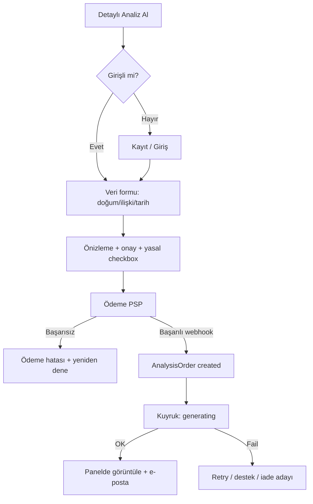
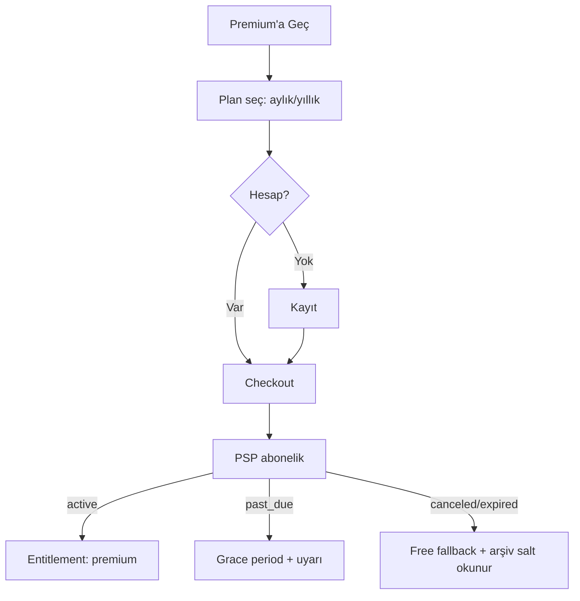

# ATLAS / CosmicSimya — Ürün, Üyelik, Ödeme ve Site Mimarisi

**Durum:** Review aşaması — production kodu yok, commit/push yok  
**Tarih:** 2026-07-30  
**Kapsam:** Yayın öncesi ürün mimarisi ve uygulanabilir yol haritası  
**Kaynak doğrulama:** Kod tabanı incelemesi (tahmin değil)  
**Dokunulmayan alanlar:** Kur’an veri mimarisi (`docs/quran-data-architecture.md`), diğer agent dosyaları, production kaynak kodu

---

## 0. Yönetici özeti

Atlas bugün **çalışan bir istihbarat çekirdeği + vitrin landing** durumundadır; henüz **satılabilir dijital ürün** değildir.

| Katman | Durum |
|--------|--------|
| Landing + Atlas sohbet + kişisel analiz + arşiv | Çalışıyor |
| Cookie session + founder login + privacy + memory | Çalışıyor |
| Günlük analiz motoru | Hesaplama var; ürün yüzeyi yok |
| Atlas Live / ses | Sunucu kısmi; UI ve gerçek TTS yok |
| Kayıt, ödeme, abonelik, admin, yasal sayfalar | Yok |
| Kalıcı DB / kuyruk / üretim hosting | Yok (JSON dosya + yerel Node) |

**Son öneri:** Ana domaine **ücretsiz beta** ile çık; ücretli katmanı ikinci aşamada aç.  
**Review kararı:** `PASS` (mimari yeterince net; uygulama başlamadan önce açık kararlar netleştirilmeli).

---

## 1. Mevcut ürün durumu (koddan doğrulandı)

### 1.1 İki yüzey bir arada

1. **CosmicSimya / Atlas ürün yüzeyi** — landing, sohbet, kişisel analiz, arşiv, about  
2. **ATLAS OS ops dashboard** (`/dashboard` … `/settings`) — çoğunlukla mock YouTube/shorts pipeline UI

Ana domaine geçerken ops shell’in public ürünle karışmaması gerekir (ayrı subdomain veya auth-gated internal).

### 1.2 Router

- `HashRouter` — `src/App.tsx`
- URL biçimi: `/#/atlas` (BrowserRouter değil)

### 1.3 Mevcut route haritası

| Path | Bileşen | Rol |
|------|---------|-----|
| `/` | `Landing` | Pazarlama vitrini |
| `/analysis` | `AnalysisFlow` | Kişisel analiz sihirbazı |
| `/analysis/result/:id` | `AnalysisResult` | Sonuç |
| `/archive` | `ArchivePage` | Kayıtlı analizler |
| `/atlas` | `Chat` | Atlas konuşması |
| `/chat` | → `/atlas` | Alias |
| `/about` | `AboutPage` | Hakkında (yasal değil) |
| `/dashboard` … `/settings` | Ops shell | Mock / iç araç |

### 1.4 Landing CTA’ları

Kaynak: `src/data/landing-content.ts`

| CTA | Hedef | Durum |
|-----|-------|--------|
| Atlas’ı keşfet | `/atlas` | Bağlı |
| Günlük analizi gör | `#gunluk-analiz` scroll | Bağlı (statik demo) |
| Atlas’ı aç | `/atlas` | Bağlı |
| Nasıl çalıştığını gör | `#nasil-calisir` | Bağlı |
| Nav: Atlas / bölümler | route + section | Bağlı |
| AuthSessionControl | giriş modal | Bağlı (founder hesabı) |
| Footer: Gizlilik / Kullanım / İletişim | hepsi → `/about` | **Placeholder** |

Günlük önizleme: sabit demo alanlar; “Temsili veriler kullanılmıştır.”  
Modül durumları çoğunlukla `gelistirilmekte` / `planlanan`.

### 1.5 Depolama

| Store | Konum |
|-------|--------|
| Hesaplar | `data/auth_accounts.json` |
| Oturumlar | `data/auth_sessions.json` |
| Kullanıcı belleği | `data/user_memory.json` |
| Analiz arşivi | `data/analysis_archive.json` |
| Privacy olayları | `data/privacy_events.json` |
| Assets | `server/generated/` |
| Daily analysis cache | bellek içi |
| Atlas Live sessions | bellek içi |

SQLite/Postgres yorumda hedeflenmiş; uygulanmamış.

---

## 2. Mevcut çalışan özellikler

### 2.1 Frontend (ürün)

- Landing kompozisyonu (`src/pages/Landing.tsx` + `src/components/landing/*`)
- Atlas sohbet UI (`src/pages/Chat.tsx` → `POST /api/chat`)
- Kişisel analiz formu + sonuç + arşiv
- Cookie tabanlı session bootstrap (`src/utils/atlas-session.ts`)
- CSRF + credentials API client (`src/services/api-client.ts`)

### 2.2 Backend auth

| Endpoint | Davranış |
|----------|----------|
| `GET /api/auth/session` | Yoksa anonymous session |
| `POST /api/auth/login` | Username/password + CSRF + rate limit |
| `POST /api/auth/logout` | Session revoke |

- Hesap provisioning: `npm run provision:founder` (public register yok)
- Account alanları: `id`, `username`, `passwordHash`, `roles[]`, `userId`, `telegramBindings[]`, `disabled`, timestamps
- Anonymous de “authenticated” sayılır (`requireAuthenticated` + anonymous userId)

### 2.3 Persistent Memory

- Profil: `name`, `timezone`, `location`, `birthDate`, `birthTime`, `birthPlace`, `referenceDate`, `relationshipStatus`
- CRUD: `/api/memory/:userId` (+ field ops)
- Ownership: `server/privacy/memory-ownership.js`
- Chat intent’leri: `server/memory-intents.js`
- AnalysisFlow doğum verisini forma yazıp memory’ye patch eder

### 2.4 Privacy (sunucu)

- Classifier, policy, authorization, context-filter, response-guard
- Chat pipeline’a bağlı (`server/atlas-message-service.js`)
- Test: `npm run test:privacy`
- **Kullanıcıya dönük yasal metin / cookie banner yok**

### 2.5 Günlük analiz (motor)

- `server/daily-analysis/` — layer registry + orchestrator
- Katmanlar: miladi/hicri zaman, hafta günü, ay evresi, astronomi, güneş, gün uzunluğu, numeroloji üçlüsü, gezegen saatleri
- `server/daily-analysis-flow.js` — intent tespiti var; **yorum:** “Not wired into atlas-message-service yet”
- HTTP route yok; landing canlı API kullanmıyor
- Test: `npm run test:daily-analysis`
- LLM interpretation şu an `null` (schema)

### 2.6 Atlas Live / ses

- Engine + HTTP mount: `/api/atlas-live/sessions…`
- `ALLOWED_VOICE_MODES = ['text-only']` — gerçek TTS API’de kapalı
- Voice provider’lar stub / mock
- Frontend Live sayfası yok

### 2.7 Diğer API

- `POST /api/personal-analysis`
- Archive CRUD
- Assets (auth’suz — production riski)
- `POST /api/ai/complete` (founder/admin)
- Telegram ayrı süreç

---

## 3. Eksik kritik özellikler

| Alan | Durum |
|------|--------|
| Public kayıt / e-posta doğrulama / şifre sıfırlama | Yok |
| Kullanıcı dashboard | Yok |
| Billing / abonelik / tek seferlik ödeme | Yok (repo’da provider izi yok) |
| Entitlement / usage limit | Yok |
| Admin paneli | Rol var; UI yok |
| Yasal sayfalar + cookie onayı + KVKK metinleri | Yok |
| Günlük analiz ürün API + canlı UI | Yok |
| Konuşma geçmişi kalıcılığı | Client-side only |
| Atlas Live tüketici UI + gerçek ses | Yok |
| İletişim formu / destek | Footer placeholder |
| Instagram / sosyal bağlantılar | Ürünleşmemiş |
| Production DB | Yok |
| Background job / kuyruk | Yok |
| E-posta servisi | Yok |
| PDF üretimi | Yok |
| Cloud / cPanel deploy config | Yok (yerel `atlas:start`) |
| Ops dashboard’un üründen ayrılması | Henüz yapılmamış |

---

## 4. Önerilen site haritası

### 4.1 Herkese açık (auth gerekmez)

| Sayfa | Amaç | Hedef kullanıcı | Ana içerik | CTA’lar | Route | Auth |
|-------|------|-----------------|------------|---------|-------|------|
| Ana Sayfa | Marka + değer önerisi | Meraklı ziyaretçi | Hero, sistemler, günlük önizleme, nasıl çalışır | Atlas’ı Aç, Ücretsiz Başla, Günlük Analizi Gör | `/` | Hayır |
| Atlas’ı Aç | Konuşma girişi | Ziyaretçi / üye | Chat UI; guest limit | Mesaj gönder, Giriş Yap, Premium | `/atlas` | Hayır (limitli) |
| Günlük Analiz | Günün katmanları | Ziyaretçi / üye | Özet veya tam analiz | Tamamını Gör, Premium’a Geç | `/gunluk-analiz` | Hayır (özet free) |
| Detaylı Analizler | Tek seferlik ürün kataloğu | Satın alma niyetli | Ürün kartları, örnek çıktı | Analiz Al, Paketleri İncele | `/analizler` | Hayır |
| Sistemler | Güven / yöntem | Araştırmacı | Katman açıklamaları, durum rozetleri | Atlas’ı Aç | `/sistemler` | Hayır |
| Nasıl Çalışır? | Eğitim | Yeni kullanıcı | 4 adımlı akış | Ücretsiz Başla | `/nasil-calisir` | Hayır |
| Fiyatlandırma | Dönüşüm | Ücretli aday | Free / Premium / tek seferlik | Premium’a Geç, Ücretsiz Dene | `/fiyatlandirma` | Hayır |
| Hakkımızda | Güven | Herkes | Misyon, yaklaşım, sınırlar | İletişim | `/hakkimizda` | Hayır |
| İletişim | Destek kanalı | Herkes | Form + e-posta + Instagram | Gönder, Instagram | `/iletisim` | Hayır |
| SSS | Dönüşüm engeli kaldırma | Kararsız | Üyelik, gizlilik, iade | Ücretsiz Başla | `/sss` | Hayır |
| Gizlilik Politikası | KVKK | Herkes | Veri işleme | — | `/gizlilik` | Hayır |
| Kullanım Koşulları | Sözleşme | Herkes | Kabul şartları + feragat | — | `/kullanim-kosullari` | Hayır |
| Çerez Politikası | Şeffaflık | Herkes | Çerez türleri | Tercihleri yönet | `/cerez-politikasi` | Hayır |
| Mesafeli Satış / Ön Bilgilendirme | E-ticaret zorunluluğu | Alıcı | Ürün/ödeme/teslimat | Satın almadan önce göster | `/mesafeli-satis` | Hayır |
| İade ve İptal | Hukuki | Alıcı | Dijital hizmet istisnaları | Destek | `/iade-iptal` | Hayır |

### 4.2 Auth gerektiren (üye paneli)

| Sayfa | Route | Auth |
|-------|-------|------|
| Kayıt | `/kayit` | Hayır (form) |
| Giriş | `/giris` | Hayır (form) |
| Panel genel bakış | `/panel` | Evet |
| Atlas (panel içi) | `/panel/atlas` | Evet |
| Günlük analizim | `/panel/gunluk-analiz` | Evet |
| Detaylı analizlerim | `/panel/analizler` | Evet |
| Analiz geçmişi | `/panel/gecmis` | Evet |
| Kaydedilen konuşmalar | `/panel/konusmalar` | Evet |
| Doğum bilgilerim | `/panel/dogum` | Evet |
| Profil | `/panel/profil` | Evet |
| Üyelik ve ödeme | `/panel/uyelik` | Evet |
| Gizlilik ayarları | `/panel/gizlilik` | Evet |
| Bildirimler | `/panel/bildirimler` | Evet |
| Hesabı sil | `/panel/hesap-sil` | Evet |
| Checkout | `/odeme/:productId` | Evet |
| Sipariş durumu | `/siparis/:orderId` | Evet |

### 4.3 İç / admin

| Sayfa | Route | Rol |
|-------|-------|-----|
| Admin | `/admin/*` | `admin` |
| Ops (mevcut dashboard) | `ops.` subdomain veya `/internal/*` | `founder` / `admin` |

**Not:** Doğum tarihi / saat / yer landing’de toplanmaz; yalnızca `/panel/dogum` ve satın alma sihirbazında, oturum + HTTPS + consent ile alınır. Mevcut `AnalysisFlow` bu modele taşınmalıdır.

---

## 5. CTA ve kullanıcı yolculukları

### 5.1 CTA kataloğu

| CTA | Başlangıç | Hedef | Guest | Free | Premium | Hata |
|-----|-----------|-------|-------|------|---------|------|
| Atlas’ı Aç | Landing / nav | `/atlas` | Session aç, mesaj limiti | Limitli sohbet | Geniş limit | “Backend kapalı” / rate limit mesajı |
| Ücretsiz Başla | Landing / fiyat | `/kayit` | Kayıt formu | Zaten üye → panel | Panel | Validation / e-posta alınmış |
| Giriş Yap | Nav | `/giris` | Login | — | — | Yanlış şifre / rate limit |
| Günlük Analizi Gör | Landing | `/gunluk-analiz` | Kısa özet | Kısa özet | Tam analiz | Konum/tarih hatası |
| Detaylı Analiz Al | `/analizler` | Checkout akışı | Login/kayıt zorunlu | Ödeme | Ödeme (veya kredi) | Ödeme fail UI |
| Premium’a Geç | Fiyat / paywall | `/fiyatlandirma` → checkout | Login sonra ödeme | Abonelik checkout | Zaten premium bilgilendirme | Webhook gecikmesi / fail |
| Paketleri İncele | Landing / analizler | `/analizler` | Katalog | Katalog | Katalog | — |
| Bize Ulaşın | Footer | `/iletisim` | Form | Form | Form | Spam / validation |
| Instagram’da Takip Et | Footer / iletişim | External | Yeni sekme | Aynı | Aynı | Link yoksa gizle |
| Analizi Kaydet | Sonuç ekranı | Archive API | Login zorunlu | Kaydet (limit) | Kaydet | Kota / ağ hatası |
| PDF Olarak İndir | Sonuç / panel | PDF endpoint | Login + entitlement | Upsell | İndir | Üretim hatası / retry |
| Üyeliği Yönet | Panel | `/panel/uyelik` | → giriş | Plan yükselt | İptal / fatura | PSP portal hatası |

### 5.2 Akış şemaları (özet)

```mermaid
flowchart TD
  A[Landing: Atlas'ı Aç] --> B{Session var mı?}
  B -->|Hayır| C[GET /api/auth/session anonymous]
  B -->|Evet| D[/atlas Chat]
  C --> D
  D --> E{Mesaj limiti aşıldı mı?}
  E -->|Hayır| F[POST /api/chat]
  E -->|Evet| G[Paywall: Ücretsiz Başla / Premium]
  F --> H{Backend OK?}
  H -->|Hayır| I[Hata: servis geçici kapalı]
  H -->|Evet| J[Yanıt + usage kaydı]
```





---

## 6. Ücretsiz üyelik modeli

### 6.1 Amaç

Atlas’ı güvenli şekilde denemek; dönüşüm hunisi oluşturmak; API maliyetini kontrol altında tutmak.

### 6.2 Önerilen içerik

| Özellik | Free |
|---------|------|
| Atlas mesajlaşması | Günlük N mesaj (ör. 10–20) |
| Günlük analiz | Kısa özet (temel katmanlar) |
| Temel astronomi / zaman katmanları | Evet |
| Sistem önizlemeleri | Evet |
| Kişisel doğum ile derin analiz | Hayır (upsell) |
| Analiz geçmişi | Kısa (ör. 7 gün / 3 kayıt) |
| Kaydetme | Sınırlı |
| PDF | Hayır |
| Sesli Atlas | Hayır |
| Gelişmiş sembolik katmanlar | Önizleme / kilitli |

### 6.3 Değerlendirme

| Ölçüt | Not |
|-------|-----|
| Kullanıcı değeri | Keşif için yeterli |
| Teknik maliyet | Düşük–orta (rate limit şart) |
| API maliyeti | LLM çağrıları sınırlanmalı |
| Destek yükü | Düşük |
| Gizlilik | Anonymous + free; doğum verisi isteğe bağlı ve panelde |
| Ölçek | JSON store ile zayıf → DB şart |
| Kötüye kullanım | Multi-account / scraping riski → device+IP+account limit |

---

## 7. Premium üyelik modeli

### 7.1 Önerilen içerik

| Özellik | Premium |
|---------|---------|
| Tam günlük analiz | Evet |
| Doğum verisiyle kişisel katman | Evet |
| Daha uzun / yüksek günlük mesaj kotası | Evet |
| Analiz geçmişi + arşiv | Evet |
| Kaydetme | Evet |
| Gelişmiş sembolik katmanlar | Entitlement ile |
| PDF çıktıları | Aylık kota |
| Sesli Atlas | Faz 3’te; kota ile |
| Öncelikli yeni özellikler | Feature flag |

### 7.2 Değerlendirme

| Ölçüt | Not |
|-------|-----|
| Kullanıcı değeri | Yüksek (tekrarlayan kullanım) |
| Teknik maliyet | Orta–yüksek (LLM, storage, PDF) |
| API maliyeti | Abonelik geliri ile dengelenmeli |
| Destek | İptal, iade, fatura soruları artar |
| Gizlilik | BirthProfile şifreleme + erişim denetimi kritik |
| Ölçek | Entitlement cache + usage ledger gerekir |
| Abuse | Shared account; device limit opsiyonel |

---

## 8. Tek seferlik analiz modeli

### 8.1 Örnek ürünler

- Detaylı doğum analizi  
- İlişki analizi  
- Belirli tarih analizi  
- Dönem analizi  
- Kişisel PDF raporu  
- Özel analiz paketi  

### 8.2 Neden gerekli?

Abonelik istemeyen ama yüksek niyetli kullanıcıyı monetize eder; üretim maliyeti yüksek işleri birim fiyatla karşılar.

### 8.3 Değerlendirme

| Ölçüt | Not |
|-------|-----|
| Kullanıcı değeri | Yüksek, somut çıktı |
| Teknik maliyet | Kuyruk + kaliteli prompt + PDF |
| API maliyeti | Sipariş başına öngörülebilir |
| Destek | “Yanlış doğum saati” düzeltmeleri sık |
| Gizlilik | Sipariş verisi ayrı şema; saklama süresi net |
| Ölçek | Worker pool |
| Abuse | Ödeme sonrası üretim; ücretsiz yeniden üretim kotası |

---

## 9. Fiyatlandırma mimarisi (kesin fiyat yok)

### 9.1 Yapı

| Ürün | Tip | Not |
|------|-----|-----|
| Premium Aylık | Abonelik | Ana tekrarlayan gelir |
| Premium Yıllık | Abonelik | İndirimli; churn düşürücü |
| Tek seferlik analiz | One-shot | Katalog fiyatı |
| Paket analizi | One-shot bundle | 3’lü / 5’li |
| Ücretsiz deneme | Trial | 7–14 gün Premium veya mesaj kredisi |
| Kredi / analiz hakkı | Wallet | Tek seferlik + premium bonus |

### 9.2 Model karşılaştırması

| Model | Artı | Eksi | Atlas uygunluğu |
|-------|------|------|-----------------|
| 1. Sınırsız abonelik | Basit | LLM maliyeti patlar | Tek başına riskli |
| 2. Mesaj kredisi | Maliyet kontrolü | UX sürtünmesi | Destekleyici iyi |
| 3. Analiz başına ödeme | Net birim ekonomi | Tekrar kullanım düşük | Tek seferlik için iyi |
| 4. Hibrit | Esnek | Uygulama karmaşık | **Önerilen** |
| 5. Free + Premium + one-shot | Tam hunı | Ürün karmaşıklığı | **Önerilen çerçeve** |

### 9.3 Öneri

**Hibrit (5 + soft krediler):**

- Free: sıkı günlük limit  
- Premium: yüksek ama **sınırsız değil** soft cap (fair use)  
- Tek seferlik: ağır analizler  
- İsteğe bağlı kredi paketi: ek mesaj / ek PDF  

Gerekçe: Atlas LLM + hesaplama + (ileride) ses maliyetlidir; “sınırsız” vaadi erken aşamada sürdürülemez. Soft cap + şeffaf kota hem güven hem ekonomi sağlar.

---

## 10. Ödeme seçenekleri karşılaştırması (Türkiye odaklı)

> Komisyon oranları sağlayıcıya/hacme göre değişir; sözleşme öncesi güncel tarife teyit edilmeli. Aşağıdaki değerlendirme 2026 piyasa araştırmasına dayanır; kesin seçim değildir.

| Ölçüt | iyzico | PayTR | Stripe TR | Lemon Squeezy | Paddle | Manuel havale |
|-------|--------|-------|-----------|---------------|--------|---------------|
| TR kullanılabilirlik | Yüksek (BDDK PI) | Yüksek | Koşullu / entity karmaşık olabilir | MoR; TR satıcı için global | MoR; global | Evet |
| Abonelik | Var (Subscription) | Recurring API | Billing güçlü | Var | Var | Zayıf |
| Tek seferlik | Var | Var | Var | Var | Var | Var |
| Webhook | Var | Var | Var | Var | Var | Yok |
| İade | Desteklenir | Desteklenir | Desteklenir | Desteklenir | Desteklenir | Manuel |
| Faturalandırma | e-fatura entegrasyonları yaygın | Yaygın | Gelişmiş | MoR fatura | MoR fatura | Manuel |
| Komisyon | Yerel sanal POS bandı | Rekabetçi | Genelde daha yüksek + FX | ~%5+ sabit | Yüksek MoR | Banka ücreti |
| KVKK / veri | Yerel PI; DPA gerekir | Yerel | Sınır ötesi transfer riski | Yurt dışı MoR | Yurt dışı MoR | Minimal kart verisi |
| Entegrasyon | Orta | Orta | DX iyi | Kolay | Kolay | Düşük teknik / yüksek ops |
| Chargeback | PI süreçleri | PI süreçleri | Güçlü araçlar | MoR üstlenir | MoR üstlenir | Nadir |

### 10.1 Öneri (kesin seçim değil)

| Öncelik | Sağlayıcı | Gerekçe |
|---------|-----------|---------|
| **Birincil (TR)** | **iyzico** | Yerel kartlar, abonelik, dokümantasyon, marketplace/escrow olgunluğu, TR SaaS için yaygın |
| **İkincil (TR)** | **PayTR** | Alternatif komisyon/settlement; iyzico reddi veya maliyet için yedek |
| **Uluslararası (sonra)** | **Paddle** (veya Polar/LS değerlendirmesi) | MoR: vergi/compliance; Lemon Squeezy’nin Stripe migration belirsizliği risk |
| **Stripe TR** | Ayrı due diligence | Hesap açılışı / tüzel kişilik şartları netleşmeden birincil yapılmamalı |
| **Havale** | Yalnızca B2B / yüksek tutar yedek | Otomasyon yok; Faz 1’de ana kanal olmasın |

**Mimari kural:** Billing provider soyutlaması (`BillingProvider` interface) — webhook → internal `Payment` + `Subscription` event’leri. Sağlayıcı değişince ürün kodu kırılmasın.

---

## 11. Önerilen yetkilendirme modeli

### 11.1 Roller

| Rol | Açıklama |
|-----|----------|
| `guest` | Anonymous session; kalıcı hesap yok |
| `free` | Kayıtlı ücretsiz |
| `premium` | Aktif abonelik entitlement |
| `support` | Destek mesajı + sipariş görüntüleme (PII maskeli) |
| `admin` | Ürün yönetimi |
| `founder` | Mevcut özel rol; internal ops |

İsteğe bağlı: `creator` (içerik), `analyst_ops` (analiz kuyruğu).

### 11.2 Kavramlar

| Kavram | Tanım |
|--------|--------|
| **plan** | `free`, `premium_monthly`, `premium_yearly` |
| **entitlement** | Kullanıcının sahip olduğu hak (`daily_analysis.full`, `chat.limit.premium`, `pdf.export`) |
| **feature flag** | Ortam/plan bazlı aç-kapa (`atlas_live_voice`) |
| **usage limit** | Dönemsel kota (günlük mesaj, aylık PDF) |
| **billing status** | `ok`, `past_due`, `refunded` |
| **subscription status** | `trialing`, `active`, `canceled`, `expired`, `paused` |
| **trial status** | `none`, `active`, `consumed` |
| **cancellation** | Dönem sonu vs anında; entitlement bitiş tarihi |
| **grace period** | Ödeme fail sonrası N gün erişim |
| **expired membership** | Free’ye düşüş; premium arşiv salt okunur |
| **refund** | Payment + entitlement revoke politikası |
| **failed payment** | Dunning + e-posta + grace |

### 11.3 Kritik kural

**Frontend yalnızca UX gösterir; yetkiyi backend doğrular.**

Her korumalı endpoint:

1. Session auth  
2. Entitlement check  
3. Usage increment (atomik)  
4. Reddet → `402` / `403` + makine-okurur kod (`LIMIT_EXCEEDED`, `PAYMENT_REQUIRED`)

---

## 12. Kullanım limitleri (örnek politika)

| Kaynak | Guest | Free | Premium |
|--------|-------|------|---------|
| Günlük Atlas mesajı | 5 | 15 | 100 (fair use) |
| Günlük analiz | Özet 1 | Özet 1 | Tam 1–3 |
| Ses (dakika/gün) | 0 | 0 | 15 (Faz 3) |
| PDF / ay | 0 | 0 | 5 |
| Kayıtlı analiz | 0 | 3 | 100 |
| Arşiv süresi | — | 30 gün | Hesap ömrü |
| Gelişmiş katman | Kilitli | Önizleme | Açık |
| Tek seferlik yeniden üretim | — | — | Sipariş başına 1 ücretsiz düzeltme |

### 12.1 Backend zorunlulukları

- Rate limit (IP + userId) — mevcut `express-rate-limit` genişletilsin  
- Abuse: aynı kart/hesap çiftliği, prompt flooding, asset endpoint auth  
- Maliyet: model seçimi (ucuz model free; premium daha güçlü), max token, cache günlük analiz  
- UsageRecord append-only ledger  

---

## 13. Detaylı analiz satış akışı (E2E)

1. Kullanıcı analiz türünü seçer (`AnalysisType`)  
2. Giriş yapar / hesap oluşturur  
3. Gerekli doğum / ilişki / tarih bilgilerini girer (`BirthProfile` / order payload)  
4. Verilerini kontrol eder (özet ekranı)  
5. Yasal checkbox’lar (mesafeli satış, KVKK, feragat)  
6. Ödeme yapar (PSP)  
7. Webhook → `Payment` success → `AnalysisOrder` `paid`  
8. Kuyruk: `queued` → `generating`  
9. UI polling / websocket: durum  
10. `completed` → panelde görüntüle  
11. Entitlement varsa PDF job  
12. E-posta: “Analiz hazır”

### 13.1 İstisna durumları

| Durum | Sistem davranışı |
|-------|------------------|
| Ödeme başarısız | Sipariş `payment_failed`; analiz üretilmez |
| Üretim başarısız | `failed`; otomatik retry 2x; sonra destek + iade adayı |
| Yanlış veri | Kullanıcı “düzeltme talebi”; 1 ücretsiz regenerate politikası |
| İptal (ödeme öncesi) | Sipariş silinir / `canceled` |
| İade | PSP refund + entitlement/order revoke + audit |
| Yeniden üretim | Admin veya self-serve kotası |
| Destek talebi | `ContactMessage` + orderId bağlantısı |

---

## 14. Kullanıcı dashboard mimarisi

| Alan | Veri modeli | İzin | Backend |
|------|-------------|------|---------|
| Genel Bakış | Usage + son analiz + plan | owner | `GET /api/me/overview` |
| Atlas | Conversation/Message | owner | chat + history API |
| Günlük Analizim | Analysis(daily) | owner + entitlement | `GET /api/daily-analysis` |
| Detaylı Analizlerim | AnalysisOrder + Analysis | owner | orders API |
| Analiz Geçmişim | Analysis list | owner | archive genişletme |
| Kaydedilen Konuşmalar | Conversation | owner | persist chat |
| Doğum Bilgilerim | BirthProfile (encrypted) | owner | memory ayrıştırılmış endpoint |
| Profilim | Profile | owner | `PATCH /api/me` |
| Üyelik ve Ödeme | Subscription, Invoice | owner | billing portal link |
| Gizlilik Ayarları | Consent + prefs | owner | consent API |
| Bildirim Ayarları | Notification prefs | owner | prefs |
| Hesabı Sil | User delete job | owner | soft delete + purge schedule |

**Doğum verisi:** Landing’de değil; panelde; ayrı `BirthProfile`; alan seviyesinde encryption-at-rest hedefi; admin’de maskeleme.

---

## 15. Admin panel mimarisi

| Modül | Amaç | PII kuralı |
|-------|------|------------|
| Kullanıcılar | Arama, disable, rol | E-posta kısmi maske |
| Üyelikler | Plan / status | — |
| Ödemeler | Reconciliation | Kart yok; PSP id |
| Siparişler | Durum / retry | Doğum alanları varsayılan gizli |
| Detaylı analizler | Kuyruk operasyonu | İçerik need-to-know |
| Kullanım istatistikleri | Maliyet / kota | Aggregate |
| Hata kayıtları | Ops | Request PII scrub |
| Destek mesajları | Inbox | Rol `support` |
| İçerik yönetimi | Landing copy / SSS | — |
| Feature flags | Rollout | — |
| Sistem sağlığı | AI, queue, disk | — |
| İade işlemleri | Refund workflow | Audit zorunlu |
| Audit log | Kim ne yaptı | Append-only |

Hassas doğum / konuşma içeriği **varsayılan olarak gösterilmez**; “geçici unlock” + sebep + TTL + audit.

---

## 16. İletişim ve sosyal medya planı

### 16.1 Kanallar

| Kanal | Yerleşim | Not |
|-------|----------|-----|
| Instagram | Footer, İletişim, Final CTA altı | Resmi hesap URL env’de |
| E-posta | `destek@…` | Public; kişisel Gmail gösterme |
| İletişim formu | `/iletisim` | Aşağıdaki alanlar |
| Destek | Panel + e-posta | Girişli kullanıcıda userId ekle |
| Hakkımızda | `/hakkimizda` | Feragat + yaklaşım |

### 16.2 Form alanları

- Ad  
- E-posta  
- Konu (enum: genel, teknik, ödeme, gizlilik, diğer)  
- Mesaj  
- KVKK aydınlatma onayı (zorunlu)  
- Spam koruması: honeypot + rate limit (+ isteğe bağlı Turnstile)

### 16.3 Teslimat önerisi

**Öneri: DB (`ContactMessage`) + admin inbox + e-posta bildirimi.**

- Yalnız kişisel e-postaya SMTP: kayıp / spam / audit yok  
- Yalnız DB: gecikmeli yanıt riski  
- Hibrit en iyisi  

---

## 17. E-posta ve bildirimler

| Olay | Kanal |
|------|-------|
| E-posta doğrulama | E-posta |
| Şifre sıfırlama | E-posta |
| Hoş geldin | E-posta |
| Ödeme başarılı / başarısız | E-posta |
| Üyelik başladı / iptal / sona eriyor | E-posta |
| Analiz hazır | E-posta + in-app |
| Destek alındı | E-posta |
| Güvenlik (yeni giriş) | E-posta |

**Genişleyebilir yapı:**

```
NotificationPreference → channels[email|in_app|push]
NotificationOutbox → templateKey, payload, status
```

Push (Faz 3) aynı outbox’a consumer ekler.

---

## 18. Gizlilik ve yasal gereksinimler

### 18.1 Zorunlu metinler / süreçler

| Gereksinim | Not |
|------------|-----|
| KVKK aydınlatma | Toplama anında |
| Açık rıza | Doğum verisi, pazarlama, çerez (gerekli olmayan) |
| Gizlilik politikası | `/gizlilik` |
| Çerez onayı | Banner + tercihler |
| Kullanım koşulları | Feragat maddeleri dahil |
| Mesafeli satış + ön bilgilendirme | Ödeme öncesi |
| İade / iptal | Dijital içerik istisnası açık yazılmalı |
| Hesap silme | Panel + süre |
| Veri dışa aktarma | JSON export |
| Saklama süresi | Analiz, log, billing ayrı politikalar |
| VERBİS | Ölçek eşiği avukat ile |

### 18.2 Ürün feragatnamesi (zorunlu görünürlük)

Astroloji, numeroloji ve sembolik analizler:

- kesin gelecek tahmini değildir  
- tıbbi, hukuki veya finansal danışmanlık değildir  
- kullanıcının kararlarının yerini almaz  

Landing principles + checkout + analiz sonucu + kullanım koşulları’nda tekrarlanmalı.

---

## 19. Veri modeli (yüksek seviye)

> Production migration oluşturulmayacak; alan önerileri.

### 19.1 Varlıklar

**User** — `id`, `email`, `emailVerifiedAt`, `passwordHash`, `roles[]`, `status`, `createdAt`  
**Profile** — `userId`, `displayName`, `timezone`, `locale`, `avatarUrl?`  
**BirthProfile** — `userId`, `birthDate`, `birthTime`, `birthPlace`, `lat`, `lng`, `accuracy`, `encryptedPayload?`  
**Session** — mevcut cookie session’ın DB hali  
**Conversation** — `userId`, `title`, `mode`, `createdAt`  
**Message** — `conversationId`, `role`, `content`, `tokens`, `createdAt`  
**AnalysisType** — `slug`, `title`, `schema`, `basePriceId`  
**Analysis** — `userId`, `type`, `inputRef`, `resultRef`, `visibility`, `createdAt`  
**AnalysisOrder** — `userId`, `productId`, `status`, `paymentId`, `inputSnapshot`, `analysisId?`  
**Product** — `sku`, `kind` (`subscription`|`one_time`), `entitlements[]`  
**Price** — `productId`, `currency`, `amount`, `interval?`  
**Subscription** — `userId`, `plan`, `status`, `currentPeriodEnd`, `pspSubscriptionId`  
**Payment** — `userId`, `amount`, `status`, `pspPaymentId`, `rawEventId`  
**Invoice** — `userId`, `url`, `pspInvoiceId`  
**Entitlement** — `userId`, `key`, `source`, `expiresAt`  
**UsageRecord** — `userId`, `metric`, `delta`, `period`, `createdAt`  
**ContactMessage** — form alanları + `status`  
**Consent** — `userId`, `type`, `version`, `grantedAt`, `ip`  
**AuditLog** — `actorId`, `action`, `target`, `meta`, `createdAt`  
**Notification** — outbox kaydı  

### 19.2 Koruma

| Veri | Koruma |
|------|--------|
| passwordHash | bcrypt (mevcut) |
| BirthProfile | Encryption-at-rest; admin mask |
| Message içeriği | Owner-only; support redacted |
| Payment | PSP token only; kart saklama yok |
| Session | HttpOnly Secure; rotate on login |
| Audit | Append-only |

Ayrıştırma: Auth User ≠ BirthProfile ≠ Analysis blob storage.

---

## 20. Teknik altyapı ihtiyaçları

### 20.1 Frontend route yapısı (hedef)

```
/                    marketing
/atlas               chat
/gunluk-analiz
/analizler
/fiyatlandirma
/kayit /giris
/panel/*             app shell
/admin/*             admin shell
/gizlilik ...        legal
```

HashRouter → production’da **BrowserRouter + SSL** önerilir (SEO, ödeme return URL).

### 20.2 Backend API grupları

```
/api/auth/*
/api/me/*
/api/chat/*
/api/daily-analysis/*
/api/analyses/* , /api/orders/*
/api/billing/* , /api/billing/webhooks/:provider
/api/entitlements/*
/api/usage/*
/api/contact/*
/api/admin/*
/api/atlas-live/*   (mevcut)
```

### 20.3 Kritik bileşenler

| Bileşen | İhtiyaç |
|---------|---------|
| Auth middleware | Session + rol + e-posta verified |
| Billing webhook | İmza doğrulama, idempotency key |
| Entitlement servisi | Cache + source of truth DB |
| Analiz kuyruğu | Redis/BullMQ veya DB poll worker |
| Background worker | Ayrı process (cPanel cron yetersiz kalabilir) |
| PDF servisi | Headless render veya template → object storage |
| E-posta | Transactional (örn. Postmark/Resend/Netgsm eşleniği) |
| Dosya saklama | S3 uyumlu / güvenli disk; assets auth |
| Logging | Structured JSON |
| Monitoring | Uptime + queue depth + LLM cost |
| Error tracking | Sentry veya eşdeğeri |
| Backup | DB + object storage günlük |
| DR | Restore runbook |

### 20.4 İhtiyaç ayrımı

| Katman | İhtiyaç |
|--------|---------|
| Statik frontend | CDN / HTTPS static |
| Node.js backend | Sürekli çalışan process (veya container) |
| Veritabanı | Postgres (önerilen) — JSON files production’da yetersiz |
| Background job | Ayrı worker |
| Kalıcı dosya | Object storage |
| SSL + domain | Zorunlu |

---

## 21. cPanel uygunluk değerlendirmesi

### 21.1 Ne için yeterli olabilir?

- Statik Vite build (landing)  
- Basit PHP/static hosting  
- Düşük trafikli tanıtım  

### 21.2 Ne için yetersiz / riskli?

| Gereksinim | cPanel gerçeği |
|------------|----------------|
| Sürekli Node (Express) | Çoğu paylaşımlı cPanel’de yok veya kısıtlı; Passenger ile sınırlı |
| WebSocket / uzun LLM isteği | Timeout riski |
| Background worker / kuyruk | Cron ≠ gerçek queue consumer |
| JSON file DB concurrency | Bozulma / kilit riski |
| Webhook güvenilirliği | Process down = ödeme kaçırma |
| Secrets / PCI bitişiği | Paylaşımlı ortam riski |
| Ölçek | Dikey değil |

### 21.3 Öneri

| Katman | Hosting |
|--------|---------|
| Frontend | CDN / static (cPanel public_html **olabilir**) |
| API + worker + DB | VPS / PaaS (Render, Fly, Railway, VPS) — **cPanel’den ayrı** |
| PSP webhooks | Public HTTPS API zorunlu |

**Sonuç:** Tam ürün için “sadece cPanel” **uygun değil**. cPanel en fazla statik vitrin için kullanılabilir.

---

## 22. MVP kararı

### A. İlk günden ücretli

**Artı:** Erken gelir  
**Eksi (mevcut koda göre):** Register yok, billing yok, yasal metin yok, daily analysis ürünleşmemiş, DB yok, destek süreci yok, ses hazır değil → chargeback / güven / KVKK riski yüksek

### B. Önce ücretsiz beta

**Artı:** Auth/register, günlük analiz yüzeyi, yasal sayfalar, destek, maliyet gözlemi, waitlist ile Premium talebi ölçümü  
**Eksi:** Erken gelir gecikir

### Öneri: **B — Ücretsiz beta**

Değerlendirme özeti:

| Faktör | Durum | Etki |
|--------|-------|------|
| Auth | Founder-only | Ücretli için yetersiz |
| Ödeme | Yok | Blokör |
| Veri güvenliği | JSON + assets auth’suz | Ücretli öncesi sertleştir |
| Destek | Yok | Ücretli risk |
| Backend kararlılığı | Yerel / tek process | Beta ile ölç |
| Ses | text-only | Ücretli vaat etme |
| Günlük analiz | Motor var, ürün yok | Beta’da önce ürünleştir |
| Yasal metinler | Yok | Blokör |
| Hosting | cPanel yetersiz | Ücret öncesi API host netleşmeli |

---

## 23. Üç aşamalı yayın planı

### AŞAMA 1 — Ücretsiz Beta

**Kapsam**

- Landing (mevcut) polish  
- Atlas konuşma (limitli)  
- Kayıt / giriş / e-posta doğrulama  
- Kullanıcı profili + doğum bilgileri paneli  
- Günlük analiz API + gerçek UI (özet)  
- İletişim formu + Instagram  
- Gizlilik + kullanım + çerez  
- Premium bekleme listesi  
- Ops routes’u public’ten ayır  

**Bağımlılıklar:** Postgres (veya en az SQLite), e-posta provider, production Node host, BrowserRouter kararı  

**Riskler:** LLM maliyeti, anonymous abuse, doğum verisi sızıntısı  

**Test:** auth, privacy, daily-analysis, memory, load smoke, KVKK checklist  

**Yayın kriteri**

- [ ] Public register çalışıyor  
- [ ] Yasal sayfalar canlı  
- [ ] Günlük analiz gerçek veri  
- [ ] Rate limit + assets auth  
- [ ] Destek formu admin’e düşüyor  
- [ ] Backup runbook var  

### AŞAMA 2 — Ücretli Ürün

**Kapsam**

- Premium abonelik (aylık/yıllık)  
- iyzico (birincil aday) entegrasyonu  
- Abonelik yönetimi  
- Tek seferlik detaylı analiz + kuyruk  
- PDF raporu  
- Kullanıcı arşivi genişletme  
- Entitlement + usage  
- Admin: kullanıcı / ödeme / sipariş  

**Bağımlılıklar:** Faz 1 tamam; tüzel / vergi; yasal e-ticaret metinleri; webhook uptime  

**Riskler:** Ödeme mutabakatı, iade, yanlış analiz beklentisi  

**Test:** webhook idempotency, dunning, refund, order failure, entitlement revoke  

**Yayın kriteri**

- [ ] Test ödemeleri + iptal + iade  
- [ ] Mesafeli satış / iade politikası  
- [ ] Grace period davranışı  
- [ ] Maliyet dashboard’u  

### AŞAMA 3 — Gelişmiş Atlas

**Kapsam**

- Sesli Atlas (gerçek TTS)  
- Gelişmiş sembolik sistemler  
- İlişki analizi  
- Kişisel sentez  
- Push / zengin bildirimler  
- Mobil deneyim (PWA veya native karar)  
- Gelişmiş admin  

**Bağımlılıklar:** Faz 2 gelir istikrarı; ses provider maliyeti; içerik kalite barı  

**Riskler:** Ses maliyeti, regülasyon, içerik iddiaları  

**Test:** voice mode gate, latency, content policy  

**Yayın kriteri**

- [ ] Ses kotası + maliyet alarmı  
- [ ] Feragat ses/metinde  
- [ ] Feature flag ile kademeli rollout  

---

## 24. Açık kararlar (onay bekleyen)

1. Marka domain ve ürün adı: ATLAS vs CosmicSimya ayrımı  
2. HashRouter → BrowserRouter geçiş zamanı  
3. Birincil PSP: iyzico mi PayTR mi? (öneri iyzico)  
4. Free günlük mesaj kotası kesin sayısı  
5. Trial: 7 gün mü, mesaj kredisi mi?  
6. Doğum verisi encryption: uygulama fazı (1 mi 2 mi?)  
7. Ops dashboard’un kalıcı mı yoksa ayrılacak mı?  
8. Kur’an / Esma katmanlarının ürün vaadi (ayrı agent; bu dokümanda vaat edilmez)  
9. Tüzel kişilik / fatura / VERBİS  
10. Ek dokümanların oluşturulması (aşağıda)

### İsteğe bağlı ek dokümanlar (onaysız oluşturulmayacak)

- `docs/atlas-site-map.md`  
- `docs/atlas-pricing-model.md`  
- `docs/atlas-payment-architecture.md`  
- `docs/atlas-launch-plan.md`  
- `docs/atlas-user-flows.md`  

---

## 25. Riskler

| Risk | Şiddet | Azaltma |
|------|--------|---------|
| Erken ücretli çıkış | Yüksek | Faz 1 beta |
| JSON store bozulması | Yüksek | Postgres |
| cPanel’de API | Yüksek | Ayrı host |
| LLM maliyet patlaması | Yüksek | Limit + cache |
| KVKK / doğum verisi | Yüksek | Consent + encryption + silme |
| Yanlış gelecek vaadi algısı | Yüksek | Feragat + UI copy |
| Assets endpoint auth’suz | Yüksek | Hemen auth |
| Ödeme webhook kaybı | Yüksek | Outbox + replay |
| Footer yasal placeholder | Orta | Gerçek sayfalar |
| Ses vaadi / hazır olmama | Orta | Faz 3’e ertele |
| Multi-agent doküman çakışması | Orta | Bu dosya tek ürün kaynağı; Kur’an doc’a dokunma |

---

## 26. Son öneri

1. **Şimdi:** Bu mimariyi onayla; production koduna geçme.  
2. **MVP:** Ücretsiz beta (Faz 1).  
3. **Monetizasyon modeli:** Free + Premium (soft cap) + tek seferlik analiz.  
4. **Ödeme:** TR için iyzico birincil aday, PayTR yedek; provider soyutlaması.  
5. **Hosting:** Frontend static olabilir; API+DB+worker cPanel dışında.  
6. **Doğum verisi:** Yalnızca güvenli panel / checkout.  
7. **Yetki:** Backend entitlement; frontend sadece UX.  
8. **Kur’an veri mimarisi agent’ına dokunma.**  

---

## 27. Değiştirilen dosyalar

| Dosya | İşlem |
|-------|--------|
| `docs/atlas-product-membership-architecture.md` | **Oluşturuldu** |

Production kaynak kodu, `docs/quran-data-architecture.md` ve diğer agent dosyaları **değiştirilmedi**.

---

## 28. Git diff özeti

- Yalnızca yeni doküman: `docs/atlas-product-membership-architecture.md`  
- Commit / push **yapılmadı** (talimat gereği)

---

## 29. Review kararı

### PASS

Mimari, mevcut kod durumuyla uyumlu; eksikler ve yayın sırası uygulanabilir seviyede netleştirildi.  
Uygulama (kod) için kullanıcı onayı bekleniyor.

**Keep / commit / push yapılmayacak — onay bekleniyor.**
