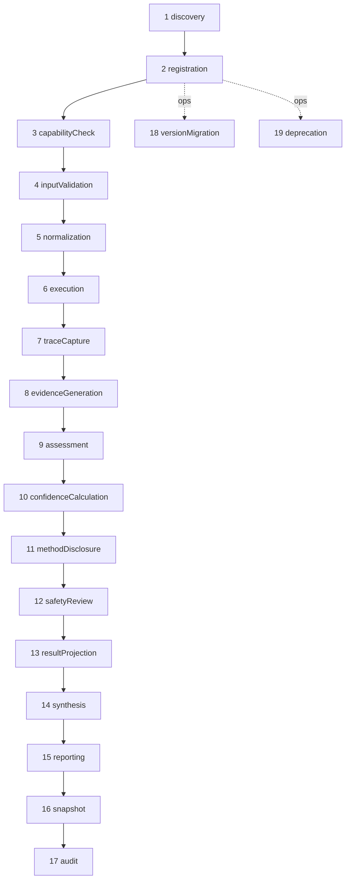

# RFC-006 — Engine Lifecycle

**Status:** Normative  
**Parent:** [ATLAS_SYMBOLIC_PLATFORM_MASTER_ARCHITECTURE.md](../ATLAS_SYMBOLIC_PLATFORM_MASTER_ARCHITECTURE.md)  
**Document id:** `atlas-rfc-006-engine-lifecycle-v1`  
**Last updated:** 2026-07-31  
**Implementation status:** Spec only

---

## 1. Purpose

Bir motorun keşfinden emekliliğine kadar **19 aşamalı yaşam döngüsünü** ve her aşamada sorumlu platform katmanını tanımlar.

---

## 2. Scope

- Lifecycle stages & owners
- Sequencing inside a single run vs platform ops stages
- Registration/discovery rules
- Deprecation & version migration hooks

---

## 3. Out of Scope

- CI tooling implementation
- HR/process ownership outside engineering artifacts

---

## 4. Definitions

| Term | Meaning |
|------|---------|
| **Run-path stage** | Executes during a user analysis request |
| **Ops-path stage** | Executes during release / migration / sunset |
| **Stage owner** | Layer accountable for pass/fail of that stage |

---

## 5. Normative Rules

1. Orchestrator **MUST** invoke run-path stages in order for each engine, except where parallel execution is explicitly safe after `normalization`.
2. Ops-path stages (discovery, registration, versionMigration, deprecation) **MUST NOT** be skipped for production engines.
3. Failure at `safetyReview` **MUST** sanitize or reject user-facing prose; **MUST NOT** alter evidence payloads’ calculated numbers.
4. `snapshot` and `audit` **MUST** occur even on partial runs (best-effort for failed engines).
5. `synthesis` **MUST** occur after source engines’ `resultProjection` inputs are available (may run before final reporting).
6. Deprecated engines **MUST** pass `capabilityCheck` as non-runnable for default product paths.

---

## 6. Lifecycle map

| # | Stage | Path | Owner layer | Input | Output / gate |
|---|-------|------|-------------|-------|---------------|
| 1 | discovery | ops | Engine Registry + build tooling | Module exports | Candidate descriptors |
| 2 | registration | ops | Engine Registry | Descriptor + execute | Registered engine |
| 3 | capabilityCheck | run | Capability Registry | NormalizedInput + flags | eligible/runnable/missing |
| 4 | inputValidation | run | Execution Orchestrator | Input + inputContract | ValidationResult |
| 5 | normalization | run | Engine (local) + shared normalizers | Raw fields | normalizedInput |
| 6 | execution | run | Engine | EngineExecutionContext | raw calc + interpretation draft |
| 7 | traceCapture | run | Trace Layer | Timing/events | trace fragment |
| 8 | evidenceGeneration | run | Engine (+ Evidence Contract) | calc artifacts | evidence[] |
| 9 | assessment | run | Engine (+ Assessment Contract) | context | assessment |
| 10 | confidenceCalculation | run | Engine (+ Confidence Contract) | axes inputs | confidence |
| 11 | methodDisclosure | run | Engine + Methodology Registry | selection path | methodDisclosure |
| 12 | safetyReview | run | Safety Layer | prose fields | sanitized result / hits |
| 13 | resultProjection | run | UI Projection Layer | EngineResult | UI card model |
| 14 | synthesis | run | Symbolic Synthesis Engine | source EngineResults | synthesis EngineResult |
| 15 | reporting | run | Reporting Layer | all results | PlatformRunReport |
| 16 | snapshot | run | Snapshot Layer | inputs + reproducibility | immutable snapshots |
| 17 | audit | run | Audit Layer | events | audit records |
| 18 | versionMigration | ops | Version Compatibility Layer | stored docs + policies | migrated read models / dual-write |
| 19 | deprecation | ops | Engine Registry + Compatibility | deprecationPolicy | disabled defaults + sunset |



---

## 7. Parallelism & isolation

- After stage 5, independent engines **MAY** run stages 6–13 in parallel.
- Hard dependencies (**RFC-001**): dependent engine starts after dependency reaches post-evidence or complete status as declared.
- Exception in one engine: catch → `failed` EngineResult; others continue (today’s orchestrator try/catch generalized).

---

## 8. Mapping to current orchestrator

| Current step | Lifecycle stage |
|--------------|-----------------|
| `normalizeInput` | 5 (partial; platform will split validation) |
| `resolveCapabilities` / consents | 3–4 |
| `runSymbolicLayer` | 6–11 (compressed) |
| `synthesizePatterns` | 14 |
| `composeUserResult` + safety filter | 12–13 |
| metadata snapshots v2 | 16 (partial, ebced-only today) |
| no formal audit events | 17 gap |
| methodology-ids constants | 1–2 gap (static, not registry) |

---

## 9. Registration contract

Discovery MUST export:

```ts
type EngineModule = {
  descriptor: import('./engine').EngineDescriptor;
  create(): import('./engine').ExecutableEngine;
};
```

Boot sequence loads modules → validates descriptor → `registry.register`.

Invalid descriptor ⇒ engine not registered; platform boots; capability lists show missing optional engines without hard crash.

---

## 10. Deprecation procedure

1. Set `status: deprecated` + `deprecationPolicy.deprecatedSince`  
2. Default product paths stop selecting engine  
3. Read path remains via Compatibility ≥ one major release (Operational Appendix)  
4. `sunsetsAfterRelease` reached → `disabled`  
5. Snapshots remain readable forever as historical records (recompute may be unavailable)

---

## 11. API Impact

- Run endpoint triggers stages 3–17.
- Admin endpoints (future) may expose registration list / disable flags (stage 2/19 controls).

---

## 12. UI Impact

- Capability discovery UI reflects stage 3 outcomes (eligible vs planned).
- Deprecation banners from stage 19 metadata.

---

## 13. Method Disclosure

Produced at stage 11; safety-reviewed at 12; projected at 13.

---

## 14. Examples

Consent failure today short-circuits before layers — maps to platform run-level failure **before** per-engine stage 3 loop (global gate), same UX.

---

## 15. Migration Impact

Introduce lifecycle gradually:

1. Wrap legacy runners as ExecutableEngine (stages 6–11 adapter)  
2. Move safety/compose to projection (12–13)  
3. Extract synthesis (14)  
4. Formalize snapshot/audit (16–17)  

---

## 16. Test Criteria

- Stage order integration test with fake engines  
- Parallel isolation test  
- Deprecation prevents default selection  
- Snapshot written on partial success  

---

## 17. Acceptance Criteria

- [ ] All 19 stages listed with owners  
- [ ] Run vs ops path distinguished  
- [ ] Parallelism/isolation rules present  
- [ ] Current orchestrator mapping table present  

---

## 18. Rejected Alternatives

| Rejected | Why |
|----------|-----|
| Unordered hooks only | Non-reproducible audits |
| Safety before evidence | Hides why claims existed; prefer sanitize presentation |
| Snapshot only on full success | Loses partial forensic value |
